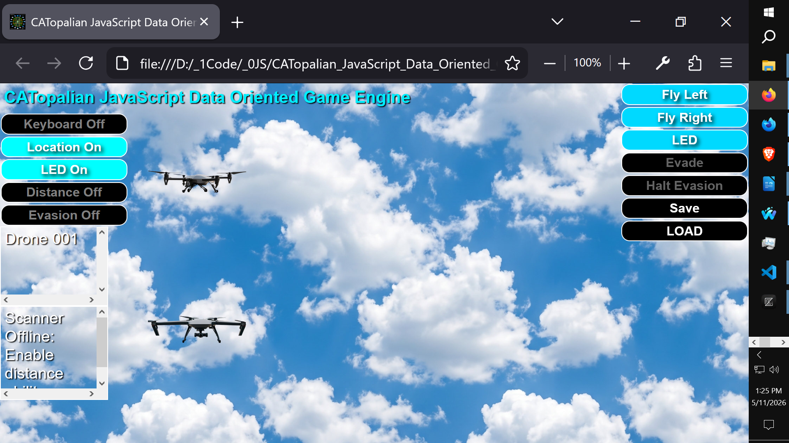
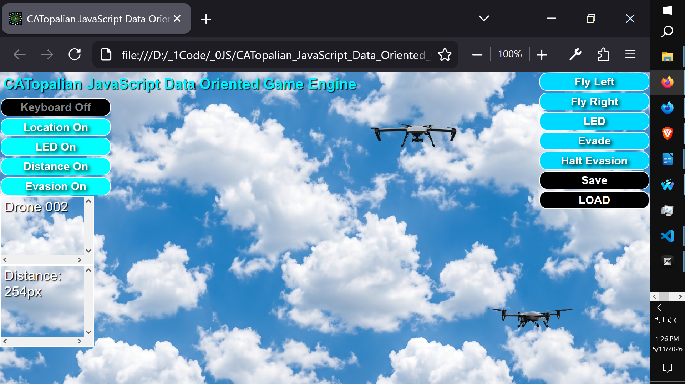

# CATopalian JavaScript Data Oriented Game Engine
A JavaScript Game Engine Designed to Simulate the Universe! This JS game engine is designed for efficiency! This game engine easily SAVES and LOADS world data in the json format!

### 🌌 A JavaScript Game Engine Designed to Simulate the Universe!

Welcome to a next-generation JavaScript game engine built from the ground up for raw performance and absolute simplicity. This engine doesn't just move boxes on a screen, it gives you the architectural blueprint to build massive, living simulations.

And yes, it flawlessly **SAVES and LOADS** entire worlds instantly using pure JSON data!

#### 🚀 The Secret of AAA Studios: Data-Oriented Design (DOD)

Most beginner tutorials teach game development the "Old Way" (heavy Object-Oriented Programming and reading HTML elements to find coordinates). The problem? The Old Way is incredibly slow. It causes massive **Cache Misses** in the CPU and forces the browser to freeze and recalculate the screen 60 times a second. If you try to build a universe the old way, your game will lag and crash before you even reach 50 objects.

This engine teaches you **Data-Oriented Design (DOD)**. This is the exact same high-performance philosophy used by the biggest AAA game studios to build massive, living open worlds (like the *Grand Theft Auto* series).

Instead of fighting the browser, we write code that modern microchips actually want to eat.

#### 🧠 The Philosophy: The Brain and The Shadow

In this engine, the HTML elements on the screen are completely "dumb." They know nothing. They are just shadows.

The absolute **Truth** of the universe lives entirely inside a pure mathematical Array called the `world`.

* **The Math:** Our systems (Evasion, Collision, Boundaries) crunch pure numbers at lightning speed.
* **The Render:** Once the math is done, our Master Loop simply tells the HTML "shadows" where to stand.

Because the CPU is only doing basic math on flat arrays instead of digging through heavy objects or scraping the DOM, this engine can easily process thousands of autonomous, colliding entities at a smooth 60 Frames Per Second.

#### ✨ Engine Features

* **Master System Loop:** Uses `requestAnimationFrame` for perfectly synced, stutter-free physics.
* **Separation of State:** Game logic is 100% decoupled from the User Interface.
* **Zero-Friction Saving:** Because the game state is just pure data, you can save and load complex universe states instantly with zero data loss.
* **Beginner Friendly:** Built entirely with readable Object Literals, no complex classes, inheritance trees, or confusing `this` binding required.

Get ready to stop building web pages, and start simulating reality!

---

Use App: https://christopherandrewtopalian.github.io/CATopalian_JavaScript_Data_Oriented_Game_Engine/CATopalian_JavaScript_Data_Oriented_Game_Engine.html

Video: https://www.youtube.com/watch?v=ZzFA8UYWJYg

---

### How to Download this App
1. Click the green Code Button on this github page
2. Choose Download ZIP
3. Save the Zip File
4. Extract All
5. Double click the HTML file to start the App

---

Happy Scripting :-)

//----//

// Dedicated to God the Father  
// All Rights Reserved Christopher Andrew Topalian Copyright 2000-2026  
// https://github.com/ChristopherTopalian  
// https://github.com/ChristopherAndrewTopalian  
// https://sites.google.com/view/CollegeOfScripting  
College of Scripting Music & Science

